# Comprehensive Internals Map: vLLM Scheduler vs. SGLang Scheduler
This document presents a deep-dive, code-level architectural comparison and annotated internals map between **vLLM's Scheduler & Block/KV-Cache Manager** and **SGLang's Scheduler & RadixCache**.
---
## 1. High-Level Paradigm & Architectural Overview
| Subsystem | vLLM (V1 Engine) | SGLang (SRT Architecture) |
| :--- | :--- | :--- |
| **Core Scheduling Strategy** | **Unified Step-Based Token Budget Loop**<br>No hard distinction between prefill & decode steps. Each request has a token budget to advance `num_computed_tokens` towards `num_tokens_with_spec`. | **Explicit Batching & Event Loop**<br>Differentiates `get_new_batch_prefill()` and `running_batch` (decodes), with optional CPU-GPU execution overlap (`event_loop_overlap`). |
| **KV Cache Abstraction** | **PagedAttention Block Allocation**<br>Fixed-size logical blocks (`KVCacheBlock`, e.g., 16/32 tokens) mapped to physical slots via `BlockPool` and content-hashing lookup for prefix matching. | **Radix Tree & Continuous Token Pool**<br>Radix Tree (`RadixCache`) storing raw token sequences in `TreeNode` edges and physical KV pool slot indices (`token_to_kv_pool_allocator`). |
| **Prefix Caching & Matching** | **Block Content Hashing**<br>Hashes full blocks of tokens. Exact match on fixed block boundaries. | **Tree-Based Prefix Matching**<br>Matches arbitrary length prefixes across Radix tree edges using exponential binary search on token IDs. Splits nodes dynamically. |
| **Eviction / Preemption** | **Preemption & Re-computation / Swapping**<br>When out of blocks, preempts running requests (lowest priority / FCFS) and frees their allocated blocks. | **Tree Eviction (LRU / Priority)**<br>Evicts unreferenced leaf nodes (`TreeNode.lock_ref == 0`) from the Radix tree to free continuous KV slots back to the allocator. |
---
## 2. Side-by-Side Annotated Internals Map

```mermaid
flowchart TD
    subgraph vLLM ["vLLM Scheduler Loop (vllm/v1/core/sched/scheduler.py)"]
        V_Start["schedule() Step Entry"] --> V_StartStep["kv_cache_manager.new_step_starts()"]
        V_StartStep --> V_SchedRun["1. Schedule RUNNING Requests"]
        
        V_SchedRun --> V_TokenBudget["Compute num_new_tokens & Token Budget"]
        V_TokenBudget --> V_AllocSlot["kv_cache_manager.allocate_slots(request, num_new_tokens)"]
        
        V_AllocSlot -- Allocation Success --> V_AppendRun["Append to scheduled_running_reqs<br>Deduct Token Budget"]
        V_AllocSlot -- Out of Blocks --> V_Preempt["Preempt Lowest Priority Running Request<br>Free Blocks -> Re-add to Waiting/Preempted"]
        V_Preempt --> V_AllocSlot
        
        V_AppendRun --> V_CheckWait{"Token Budget > 0<br>& No Preemptions?"}
        V_CheckWait -- Yes --> V_SchedWait["2. Schedule WAITING Requests"]
        V_CheckWait -- No --> V_Output["Build SchedulerOutput<br>(CachedRequestData, NewRequestData)"]
        
        V_SchedWait --> V_MatchPrefix["kv_cache_manager.allocate_slots(waiting_req)"]
        V_MatchPrefix --> V_Promote["Move WAITING -> RUNNING"]
        V_Promote --> V_Output
    end
    subgraph SGLang ["SGLang Scheduler Loop (sglang/srt/managers/scheduler.py)"]
        S_Start["event_loop_normal() / event_loop_overlap()"] --> S_Recv["Receive & Process Input Requests"]
        S_Recv --> S_GetNext["get_next_batch_to_run()"]
        
        S_GetNext --> S_MergeLast["Merge last prefill batch into running_batch (decodes)"]
        S_MergeLast --> S_PrefillCheck{"Should schedule Prefill?"}
        
        S_PrefillCheck -- Yes --> S_PrefillPlan["get_new_batch_prefill()<br>PrefillAdder iterates waiting_queue"]
        S_PrefillPlan --> S_RadixMatch["tree_cache.match_prefix(key)<br>Find longest prefix in Radix Tree"]
        
        S_RadixMatch --> S_AllocKV["token_to_kv_pool_allocator.alloc(new_tokens)"]
        S_AllocKV -- Out of Memory --> S_RadixEvict["tree_cache.evict(needed_size)<br>Evict unreferenced leaf TreeNodes"]
        S_RadixEvict --> S_AllocKV
        
        S_AllocKV --> S_FormBatch["Form Prefill ScheduleBatch"]
        S_PrefillCheck -- No --> S_FormDecode["Decode ScheduleBatch (running_batch)"]
        
        S_FormBatch --> S_RunBatch["run_batch(batch)<br>Execute GPU Model Runner"]
        S_FormDecode --> S_RunBatch
        
        S_RunBatch --> S_ProcessRes["process_batch_result()<br>Insert completed/unfinished KVs into Radix Tree"]
    end
```

---
## 3. Data Structures & KV Cache Storage Internals
### 3.1 vLLM: Paged Memory with Block Pool & Hash Tree
In vLLM V1 (`vllm/v1/core/kv_cache_manager.py` & `block_pool.py`):
1. **`KVCacheBlock`**: Represents a fixed-size chunk of tokens (e.g., 16 or 32 tokens). Has a `block_id`, `ref_cnt`, and optional `block_hash`.
2. **`BlockPool`**: Manages free and allocated block IDs. Free blocks are tracked via a stack/deque for fast allocation.
3. **Prefix Caching (`KVCacheManager`)**:
   - Computes a content hash for every full block of tokens (`hash(prev_block_hash + token_ids)`).
   - Looks up block hashes in a global hash table (`cached_block_hash_to_block`).
   - If a match is found, increments the reference count of the existing physical block ID (`ref_cnt += 1`).
   - If no match, allocates a new physical block ID from `BlockPool`.
```python
# Code snippet conceptual flow: vllm/v1/core/kv_cache_manager.py
class KVCacheManager:
    def allocate_slots(self, request: Request, num_tokens: int) -> KVCacheBlocks | None:
        # 1. Determine how many new blocks are required for num_tokens
        # 2. For computed tokens, query hash table for prefix cache hits
        # 3. For uncomputed tokens, pop free block IDs from BlockPool
        # 4. Return KVCacheBlocks containing allocated block IDs per KV group
```
---
### 3.2 SGLang: RadixCache Tree & Continuous Memory Pool
In SGLang (`sglang/python/sglang/srt/mem_cache/radix_cache.py` & `memory_pool.py`):
1. **`TreeNode`**:
   - `children`: `dict[dict_key, TreeNode]` mapping token prefix branches to child nodes.
   - `key`: `RadixKey` containing a continuous `array('q', token_ids)`.
   - `value`: `torch.Tensor` of physical KV cache slot indices in `token_to_kv_pool_allocator`.
   - `lock_ref`: Reference counter indicating active requests using this node. Nodes with `lock_ref > 0` cannot be evicted.
   - `last_access_time` / `priority`: Used by eviction policy (LRU / LFU / Priority).
2. **Prefix Matching (`RadixCache.match_prefix`)**:
   - Traverses tree from `root_node` matching token sequences.
   - Uses **galloping exponential search** + binary search over token IDs (`RadixKey.match`) for fast prefix comparison without Python token loops.
   - If a request matches a prefix mid-way inside an existing node, **splits the node** into parent and child nodes to form an exact boundary.
3. **Eviction (`RadixCache.evict`)**:
   - When memory pool is full during allocation, SGLang collects evictable leaf nodes (`TreeNode`s where `lock_ref == 0` and `children` is empty).
   - Removes leaf nodes from tree and calls `token_to_kv_pool_allocator.free(node.value)` to recover slot indices.
```python
# Code snippet conceptual flow: sglang/srt/mem_cache/radix_cache.py
class RadixCache(BasePrefixCache):
    def match_prefix(self, params: MatchPrefixParams) -> MatchResult:
        # Traverses Radix Tree, matches longest prefix key
        # Splits node if match boundary is inside a node
        # Returns concatenated device_indices (KV pool indices) and terminal TreeNode
        
    def insert(self, params: InsertParams) -> InsertResult:
        # Inserts new token sequence and corresponding KV slot indices into Radix Tree
        
    def evict(self, size: int) -> int:
        # Pops evictable leaves from radix tree (LRU/Priority order) until 'size' slots freed
```
---
## 4. Deep-Dive Code-Level Scheduling Loop Walkthrough
### 4.1 vLLM Scheduling Step (`vllm/v1/core/sched/scheduler.py`)
#### Step 1: Initialize Step & Schedule Running Requests
```python
# vllm/v1/core/sched/scheduler.py -> Scheduler.schedule()
def schedule(self) -> SchedulerOutput:
    self.current_step += 1
    self.kv_cache_manager.new_step_starts()
    req_index = 0
    while req_index < len(self.running) and token_budget > 0:
        request = self.running[req_index]
        num_new_tokens = (
            request.num_tokens_with_spec
            + request.num_output_placeholders
            - request.num_computed_tokens
        )
        num_new_tokens = min(num_new_tokens, token_budget)
        # Allocate KV cache slots for new tokens
        while True:
            new_blocks = self.kv_cache_manager.allocate_slots(
                request, num_new_tokens, num_lookahead_tokens=self.num_lookahead_tokens
            )
            if new_blocks is not None:
                break
            
            # Out of blocks -> Preempt lowest priority running request
            preempted_req = self._select_preemption_victim()
            self._preempt_request(preempted_req, scheduled_timestamp)
```
#### Step 2: Schedule Waiting Requests (Prefills)
```python
    # Schedule WAITING requests if budget remains and no preemptions occurred
    if not preempted_reqs and self._pause_state == PauseState.UNPAUSED:
        while (self.waiting or self.skipped_waiting) and token_budget > 0:
            request = request_queue.peek_request()
            
            # Check prefix cache hit & allocate slots
            new_blocks = self.kv_cache_manager.allocate_slots(request, num_new_tokens)
            if new_blocks is None:
                break # Cannot allocate waiting request -> stop admitting
            
            self.running.append(request)
            self.waiting.remove(request)
```
---
### 4.2 SGLang Event Loop (`sglang/srt/managers/scheduler.py`)
#### Step 1: Event Loop Execution
```python
# sglang/python/sglang/srt/managers/scheduler.py -> event_loop_normal()
def event_loop_normal(self):
    while True:
        recv_reqs = self.request_receiver.recv_requests()
        self.process_input_requests(recv_reqs)
        # Build next batch (Prefill or Decode)
        plan = self.get_next_batch_to_run(
            running_batch=self.running_batch, last_batch=self.last_batch
        )
        self.running_batch = plan.running_batch
        batch = plan.batch_to_run
        if batch:
            result = self.run_batch(batch)
            self.process_batch_result(batch, result)
```
#### Step 2: Prefill Batch Assembly & Radix Cache Lookup
```python
# sglang/python/sglang/srt/managers/scheduler.py -> _get_new_batch_prefill_raw()
def _get_new_batch_prefill_raw(self, running_batch: ScheduleBatch):
    adder = PrefillAdder(...)
    
    for req in self.waiting_queue:
        # Match request prompt in RadixCache
        radix_key = RadixKey(req.origin_input_ids, ...)
        match_result = self.tree_cache.match_prefix(MatchPrefixParams(key=radix_key))
        prefix_len = len(match_result.device_indices)
        
        # Lock reference to prevent eviction during execution
        self.tree_cache.inc_lock_ref(match_result.last_device_node)
        
        # Allocate remaining un-cached tokens from continuous token pool
        needed_tokens = len(req.origin_input_ids) - prefix_len
        kv_indices = self.token_to_kv_pool_allocator.alloc(needed_tokens)
        
        if kv_indices is None:
            # Out of memory -> Evict unreferenced nodes from Radix Tree
            self.tree_cache.evict(needed_tokens)
            kv_indices = self.token_to_kv_pool_allocator.alloc(needed_tokens)
```
---
## 5. Comparative Summary: Key Architectural Tradeoffs
```
                       +----------------------------------+----------------------------------+
                       |          vLLM Scheduler          |         SGLang Scheduler         |
+----------------------+----------------------------------+----------------------------------+
| Granularity          | Block-level (16/32 tokens)       | Token-level / Dynamic (RadixKey) |
| Prefix Cache Lookup  | Block hash table (`BlockPool`)   | Radix Tree matching (`RadixCache`)|
| Memory Fragmentation | Internal block fragmentation     | Minimal (Flat Pool Allocator)    |
| Re-use Flexibility   | Exact block boundary matches     | Arbitrary prefix sharing         |
| Preemption vs Eviction| Preempts running requests to free| Evicts idle Radix Tree leaf nodes|
| Loop Style           | Single unified step loop         | Differentiated Prefill/Decode    |
+----------------------+----------------------------------+----------------------------------+
```
1. **vLLM's Block-Based Design**: Simplified accounting via fixed block size. Highly optimized for CUDA graphs and tensor parallel state propagation across workers.
2. **SGLang's RadixCache Design**: Zero-waste prefix matching at arbitrary token granularities. Extremely efficient for multi-turn conversations, complex agent branching, system prompts, and tree-search workloads.
